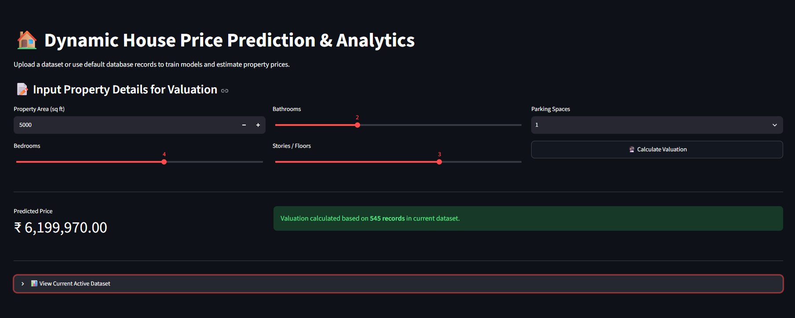

# Dynamic House Price Prediction & Analytics Engine

An end-to-end Machine Learning web application built with Python, Scikit-Learn, SQLite, and Streamlit. It allows users to dynamically upload custom housing datasets, train real-time ML regression models, and calculate property valuations with an interactive user interface.

### 📸 Dashboard Preview


## 📌 Features
* **Dynamic Dataset Upload:** Support for uploading custom CSV files directly from the Streamlit UI.
* **SQL & CSV Integration:** Fallback data ingestion from local SQLite database (`housing_database.db`) and `Housing.csv`.
* **ML Valuation Model:** Automated Feature Scaling and Random Forest Regression model for property price estimation.
* **Interactive UI:** Real-time user input controls (area, bedrooms, bathrooms, floors, parking) for instant pricing.

## 🛠 Repository Structure
* `app.py`: Interactive Streamlit application frontend with dynamic file uploader.
* `SQLIntegration.py`: Database management and SQL querying pipeline.
* `housing_database.db`: SQLite database storing real estate transaction data.
* `Housing.csv`: Default housing dataset.
* `README.md`: Project documentation and setup instructions.

## 🚀 Quickstart Guide

1. **Clone the repository:**
   ```bash
   git clone [https://github.com/gopals09920/House-Price-Prediction-ML.git](https://github.com/gopals09920/House-Price-Prediction-ML.git)
   cd House-Price-Prediction-ML